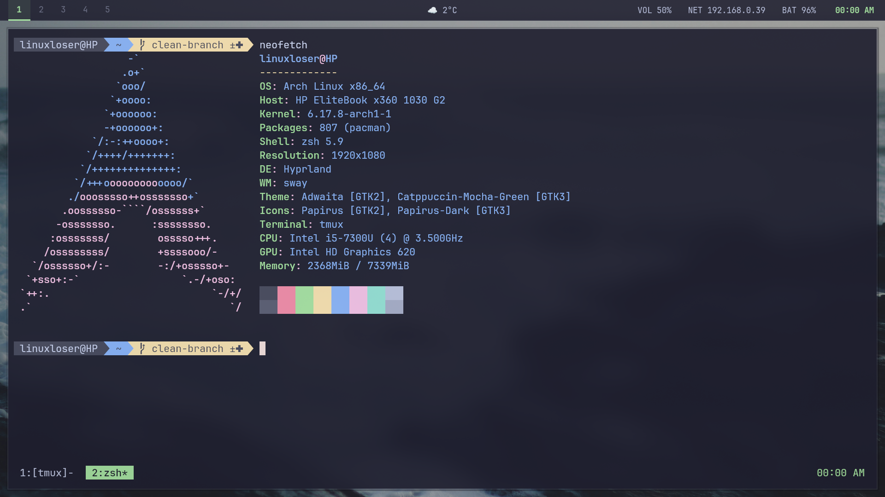

# Hyprland Dotfiles

> A clean, production-ready Arch Linux desktop environment configured for optimal performance and aesthetics with the Catppuccin Mocha Green theme.

[](https://hyprland.org/)
[](https://archlinux.org/)
[](https://github.com/catppuccin)
[](LICENSE)

## Preview


*Clean workspace with Catppuccin Mocha Green theme - showing Neofetch, Waybar, and Tmux integration*

## Features

*   **Unified Theming:** Consistent Catppuccin Mocha Green color scheme across all components (WM, bar, terminal, editor, launcher, OSD).
*   **Vim-like Navigation:** Consistent `Ctrl+h/j/k/l` for seamless focus and pane movement across Neovim, Tmux, and Hyprland.
*   **Dual Aesthetics:** Easily switch between rounded and sharp corner modes for windows and UI elements.
*   **Dynamic Effects Toggle:** Enable/disable blur, shadows, and transparency on demand for performance or visual preference.
*   **Automated Wallpapers:** Rotation script with multi-monitor support, smooth transitions, and instant refresh on monitor connect/disconnect.
*   **Custom Waybar:** Feature-rich status bar with weather integration, system monitoring, and green accents.
*   **Optimized Performance:** Configuration choices prioritize responsiveness and efficiency, especially in Hyprland.
*   **Detailed Documentation:** Extensive English comments within configuration files explain the *why* behind design and functional decisions.

## Components

| Component         | Description                                                                 | Key Features                                                                   |
| :---------------- | :-------------------------------------------------------------------------- | :----------------------------------------------------------------------------- |
| **WM**            | Hyprland - Modern Wayland tiling compositor                                 | Dwindle layout, dynamic monitor setup, custom keybinds.                        |
| **Bar**           | Waybar - Customizable status bar                                            | Workspaces, weather, volume, network, battery, clock with green accents.       |
| **Terminal**      | Kitty - GPU-accelerated terminal                                            | Nerd Font support, background opacity, Catppuccin colors.                      |
| **Shell**         | Zsh - Enhanced shell with Oh My Zsh                                         | (Implicit, assumed from Tmux auto-start)                                       |
| **Multiplexer**   | Tmux - Session persistence & pane management                                | Vim integration, Wayland clipboard, custom status line.                        |
| **Editor**        | Neovim - Preconfigured with lazy.nvim                                       | Catppuccin Mocha theme, efficient plugin management, Vim-like navigation.      |
| **Launcher**      | Albert - Application launcher                                               | Catppuccin Mocha Green theme, toggleable, configurable size.                   |
| **Display Manager** | SDDM - Login screen                                                         | Catppuccin Mocha Green theme for a unified boot experience.                    |
| **OSD**           | SwayOSD - On-screen display for volume/brightness                           | Themed notifications with progress bars, green accent.                         |
| **Boot Splash**   | Plymouth - Graphical boot splash screen                                    | Replaces text-based boot messages with polished graphics. Intel GPU optimized. |
| **Bootloader**    | GRUB - Bootloader with LUKS encrypted root support                         | Kernel parameters tuned for Plymouth, encryption, and USB stability.           |
| **Theme**         | Catppuccin Mocha Green - Consistent dark pastel palette                     | Applied across all major components for a cohesive visual experience.          |

## Quick Start

### Installation

```bash
# Clone repository
git clone https://github.com/merneo/dotfiles.git
cd dotfiles

# Install configurations (using manual copy; 'stow' is an alternative)
# It's recommended to back up your existing configurations before proceeding.
cp -r hypr/.config/hypr ~/.config/
cp -r waybar/.config/waybar ~/.config/
cp -r kitty/.config/kitty ~/.config/
cp -r nvim/.config/nvim ~/.config/
cp -r albert/.local/share/albert ~/.local/share/
cp -r swayosd/.config/swayosd ~/.config/
cp tmux/.tmux.conf ~/
cp -r scripts/.local/bin ~/.local/

# SDDM theme (requires root privileges)
sudo cp -r sddm/usr/share/sddm/themes/catppuccin-mocha-green /usr/share/sddm/themes/
sudo cp sddm/etc/sddm.conf.d/*.conf /etc/sddm.conf.d/

# Boot configuration - Plymouth & GRUB (optional but recommended)
# See grub/README.md and plymouth/README.md for detailed setup
sudo cp grub/etc/default/grub /etc/default/grub
sudo cp plymouth/etc/mkinitcpio.conf /etc/mkinitcpio.conf
sudo mkinitcpio -P
sudo grub-mkconfig -o /boot/grub/grub.cfg

# Make scripts executable
chmod +x ~/.local/bin/*.sh
chmod +x ~/.config/waybar/weather.sh

# Restart Hyprland or log out/in to apply changes
hyprctl reload
```

### Requirements

**Core Packages (Arch Linux)**
```bash
sudo pacman -S hyprland waybar kitty tmux neovim albert
yay -S ttf-jetbrains-mono-nerd swayosd
```

**Boot Configuration (Optional but Recommended)**
```bash
# Plymouth splash screen
sudo pacman -S plymouth

# GRUB bootloader (usually pre-installed)
sudo pacman -S grub
```

**Optional Utilities**
```bash
# Wallpaper engine
yay -S swww

# Weather module (Waybar)
sudo pacman -S curl awk jq # 'jq' is needed for wallpaper script monitor detection
```

## Configuration & Usage

### Hyprland Modes

 These dotfiles support dynamic switching between two primary Hyprland aesthetics:

*   **Rounded Mode:**
    *   Features: Rounded corners (12px radius), smooth animations.
    *   Activate: `Super+Shift+R` (or `Super+Ctrl+R`).
*   **Corner Mode:**
    *   Features: Sharp, square corners, instant window transitions (animations disabled).
    *   Activate: `Super+Shift+C` (or `Super+Ctrl+C`).

### Effects Control

Toggle blur, shadows, and transparency for enhanced performance or visual preference:

```bash
Super+Shift+E  # Toggles all effects (blur, shadows, varying opacity)
```

### Keybindings

The configuration uses a consistent `Super` key (`$mainMod`) as the primary modifier. Many actions also leverage Vim-like navigation (`H/J/K/L`).

| Shortcut            | Action                                                              |
| :------------------ | :------------------------------------------------------------------ |
| `Super+Q`           | Launch Kitty terminal                                               |
| `Super+E`           | Launch Dolphin file manager                                         |
| `Super+R`           | Toggle Albert application launcher                                  |
| `Alt+Space`         | Toggle Albert application launcher (alternative)                    |
| `Super+C`           | Close focused window                                                |
| `Super+M`           | Log out of Hyprland                                                 |
| `Super+V`           | Toggle floating mode for focused window                             |
| `F11`               | Toggle fullscreen for focused window                                |
| `Super+S`           | Take screenshot (save to `~/`)                                      |
| `Super+Shift+S`     | Activate "Screenshot Mode" (static time, clean UI)                  |
| `Super+Shift+F`     | Exit "Screenshot Mode"                                              |
| `Super+H/J/K/L`     | Move focus between windows (Vim-style)                              |
| `Super+Shift+H/J/K/L` | Move focused window within workspace (Vim-style)                  |
| `Super+O`           | Move focus to next monitor                                          |
| `Super+Shift+O`     | Move focused window to next monitor                                 |
| `Super+[1-10]`      | Switch to specific workspace                                        |
| `Super+Shift+[1-10]`| Move focused window to specific workspace                           |
| `Super+A`           | Toggle special workspace (`magic` - e.g., scratchpad terminal)      |
| `Super+Shift+A`     | Move focused window to special workspace                            |
| `Alt+V`             | Tmux: Vertical split pane                                           |
| `Alt+S`             | Tmux: Horizontal split pane                                         |
| `Alt+Q`             | Tmux: Kill pane                                                     |
| `Alt+H/J/K/L`       | Tmux: Navigate panes                                                |
| `Alt+Shift+H/J/K/L` | Tmux: Resize panes                                                  |
| `Alt+[ `            | Tmux: Enter copy mode                                               |
| `Alt+P`             | Tmux: Paste from buffer                                             |
| `XF86Audio*`        | Volume control (via SwayOSD)                                        |
| `XF86MonBrightness*`| Brightness control (via SwayOSD)                                    |

## Detailed Documentation

Each configuration file now includes extensive English comments explaining the *rationale* (`why`) behind specific settings and design choices. This enhances readability and makes future modifications easier. Key areas documented include:

*   **Hyprland:** Monitor detection logic, autostart order, window rules, layout philosophy, and keybinding strategies.
*   **Waybar:** Module arrangement, sensor usage, color palette integration, and hover effects.
*   **Kitty:** Font selection, transparency, cursor behavior, and detailed color palette breakdown.
*   **Neovim:** Lazy.nvim bootstrapping, core `vim.opt` settings, and plugin management.
*   **Tmux:** Prefix key rationalization, pane management, status bar customization, and Wayland clipboard integration.
*   **Albert:** Theme styling (colors, shapes, transparency), ensuring consistency with system theme.
*   **Scripts:** Purpose, dependencies, and step-by-step logic for wallpaper rotation, screenshot mode, and effects toggling.

## Directory Structure

```
dotfiles/
├── hypr/                    # Hyprland configs (WM rules, keybinds, appearance)
│   └── .config/hypr/
│       ├── hyprland.conf           # Main Hyprland configuration
│       ├── hyprland-rounded.conf   # Settings for rounded window aesthetics
│       └── hyprland-corner.conf    # Settings for sharp window aesthetics
├── waybar/                  # Waybar status bar configuration
│   └── .config/waybar/
│       ├── config.jsonc     # Module configuration and order
│       ├── style.css        # Catppuccin Mocha Green styling for Waybar
│       └── weather.sh       # Script to fetch weather data for Waybar
├── kitty/                   # Kitty terminal emulator configuration
│   └── .config/kitty/
│       └── kitty.conf       # Font, transparency, and Catppuccin colors
├── nvim/                    # Neovim text editor configuration
│   └── .config/nvim/
│       ├── init.lua         # Main configuration and lazy.nvim bootstrap
│       └── lua/plugins/     # Plugin definitions and settings
├── tmux/                    # Tmux terminal multiplexer configuration
│   └── .tmux.conf          # Keybinds, status bar, and plugin management
├── albert/                  # Albert launcher theme
│   └── .local/share/albert/
│       └── widgetsboxmodel/themes/
│           ├── Catppuccin Mocha.qss         # Sharp variant (Corner Mode)
│           └── Catppuccin Mocha Rounded.qss # Rounded variant (Rounded Mode)
├── swayosd/                 # SwayOSD on-screen display theme
│   └── .config/swayosd/
│       └── style.css        # Catppuccin Mocha Green styling for OSD pop-ups
├── sddm/                    # SDDM login screen theme
│   ├── usr/share/sddm/themes/
│   │   └── catppuccin-mocha-green/  # Complete SDDM theme
│   └── etc/sddm.conf.d/
│       ├── theme.conf       # SDDM theme activation
│       └── kde_settings.conf # KDE specific settings for SDDM
├── scripts/                 # Collection of utility shell scripts
│   └── .local/bin/
│       ├── wallpaper-rotate.sh     # Automates wallpaper changes
│       ├── wallpaper-change.sh     # Changes wallpaper instantly
│       ├── effects-toggle.sh       # Toggles visual effects (blur, transparency)
│       ├── effects-on.sh           # Enables visual effects
│       └── effects-off.sh          # Disables visual effects
├── grub/                    # GRUB bootloader configuration
│   ├── etc/default/
│   │   └── grub             # GRUB configuration with Plymouth support
│   └── README.md            # GRUB setup instructions
├── plymouth/                # Plymouth splash screen configuration
│   ├── etc/
│   │   └── mkinitcpio.conf  # Initramfs hooks with Plymouth and i915 GPU driver
│   └── README.md            # Plymouth setup and troubleshooting guide
└── README.md               # This documentation file
```

## Troubleshooting

*   **Waybar not starting?**
    ```bash
    pkill waybar && waybar &
    ```
*   **Weather module not showing?**
    *   Check internet connection.
    *   Verify `curl` and `jq` are installed: `which curl && which jq`.
    *   Test script: `~/.config/waybar/weather.sh`.
*   **Workspaces not showing in Waybar?**
    *   Ensure Hyprland is running.
    *   Check: `hyprctl version`.
*   **Font issues?**
    ```bash
    # Install JetBrainsMono Nerd Font
    yay -S ttf-jetbrains-mono-nerd
    # Restart applications after install
    ```
*   **Wallpaper script not working?**
    *   Install `swww`: `yay -S swww`.
    *   Create wallpaper directory: `mkdir -p ~/Pictures/Wallpapers/walls/`.
    *   Check logs: `tail -f /tmp/wallpaper-rotate.log`.
*   **Tmux not starting?**
    *   Check `.bashrc` or `.zshrc` for tmux auto-start.
    *   Manual start: `tmux new-session -s main`.
*   **Plymouth splash screen not showing?**
    *   See `grub/README.md` and `plymouth/README.md` for detailed boot configuration.
    *   Quick fix: Ensure `mkinitcpio.conf` has `i915` in MODULES and `plymouth` in HOOKS.
    *   Regenerate initramfs: `sudo mkinitcpio -P`.
    *   Verify kernel parameters: `cat /proc/cmdline | grep plymouth`.

## Color Palette

This configuration utilizes the **Catppuccin Mocha Green** color scheme.

| Color      | Hex       | Usage                                  |
| :--------- | :-------- | :------------------------------------- |
| Base       | `#1e1e2e` | Backgrounds                            |
| Text       | `#cdd6f4` | Foreground, primary text               |
| Green      | `#a6e3a1` | Accent color (active elements, clock)  |
| Blue       | `#89b4fa` | Selection backgrounds, borders         |
| Red        | `#f38ba8` | Errors, critical alerts                |
| Yellow     | `#f9e2af` | Warnings                               |
| Pink       | `#f5c2e7` | Highlights                             |
| Rosewater  | `#f5e0dc` | Cursor, special highlights             |
| Surface0   | `#313244` | Hover states, muted backgrounds        |
| Surface1   | `#45475a` | Pane borders, scrollbar handles        |
| Surface2   | `#585b70` | Secondary muted elements               |
| Overlay0   | `#6c7086` | Muted text, disabled elements          |

## License

This project is licensed under the MIT License - see the [LICENSE](LICENSE) file for details.

## Credits

*   Theme: [Catppuccin](https://github.com/catppuccin)
*   WM: [Hyprland](https://hyprland.org/)
*   Inspiration: The r/unixporn community